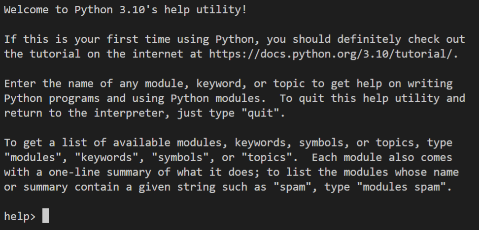
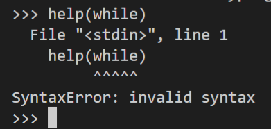

[Contents](../Contents.md) \| [Next (1.2 A First Program)](02_Hello_world.md)

# 1.1 Python

### What is Python?

Python is an interpreted high level programming language.  It is often classified as a
["scripting language"](https://en.wikipedia.org/wiki/Scripting_language) and
is considered similar to languages such as Perl, Tcl, or Ruby.  The syntax
of Python is loosely inspired by elements of C programming.

Python was created by Guido van Rossum around 1990 who named it in honor of Monty Python.

### Where to get Python?

[Python.org](https://www.python.org/) is where you obtain Python.  For the purposes of this course, you
only need a basic installation.  I recommend installing Python 3.6 or newer. Python 3.6 is used in the notes
and solutions.

### Why was Python created?

In the words of Python's creator:

> My original motivation for creating Python was the perceived need
> for a higher level language in the Amoeba [Operating Systems]
> project. I realized that the development of system administration
> utilities in C was taking too long. Moreover, doing these things in
> the Bourne shell wouldn't work for a variety of reasons. ... So,
> there was a need for a language that would bridge the gap between C
> and the shell.
>
> - Guido van Rossum

### Where is Python on my Machine?

Although there are many environments in which you might run Python,
Python is typically`通常` installed on your machine as a program that runs
from the terminal or command shell. From the terminal, you should be
able to type `python` like this:

```
bash $ python
Python 3.8.1 (default, Feb 20 2020, 09:29:22)
[Clang 10.0.0 (clang-1000.10.44.4)] on darwin
Type "help", "copyright", "credits" or "license" for more information.
>>> print("hello world")
hello world
>>>
```

If you are new to using the shell or a terminal, you should probably
stop, finish a short tutorial on that first, and then return here.

Although there are many non-shell environments where you can code
Python, you will be a stronger Python programmer if you are able to
run, debug, and interact with Python at the terminal.  This is
Python's native environment.  If you are able to use Python here, you
will be able to use it everywhere else.

## Exercises

### Exercise 1.1: Using Python as a Calculator

On your machine, start Python and use it as a calulator to solve the
following problem.

Lucky Larry bought 75 shares of Google stock at a price of \$235.14 per
share. Today, shares of Google are priced at \$711.25. Using Python’s
interactive mode as a calculator, figure out how much profit Larry would
make if he sold all of his shares.

```python
>>> (711.25 - 235.14) * 75
35708.25
>>>
```

Pro-tip: **Use the underscore (\_) variable to use the result of the last
calculation**. For example, how much profit does Larry make after his evil
broker takes their 20% cut?

```python
>>> _ * 0.80
28566.600000000002
>>>
```

### Exercise 1.2: Getting help

```Type help() for interactive help, or help(object) for help about object.```


Use the `help()` command to get help on the `abs():Return the absolute value of the argument.` function. Then use
`help()` to get help on the `round()` function. Type `help()` just by
itself with no value to enter the interactive help viewer.

One caution with `help()` is that it doesn’t work for basic Python
statements`简单语句` such as `for`, `if`, `while`, and so forth (i.e., if you type
`help(for)` you’ll get a syntax error). You can try putting the help
topic in quotes such as **`help("for")`** instead. If that doesn’t work,
you’ll have to turn to an internet search.

Followup: Go to <http://docs.python.org> and find the documentation for
the `abs()` function (hint: it’s found under the library reference
related to built-in functions).

### Exercise 1.3: Cutting and Pasting

This course is structured as a series of traditional web pages where
you are encouraged to try interactive Python code samples **by typing
them out by hand.** If you are learning Python for the first time,
this "slow approach" is encouraged.  You will get a better feel for
the language by slowing down, typing things in, and thinking about
what you are doing.

If you must "cut and paste" code samples, select code
starting after the `>>>` prompt and going up to, but not any further
than the first blank line or the next `>>>` prompt (whichever appears
first). Select "copy" from the browser, go to the Python window, and
select "paste" to copy it into the Python shell. To get the code to
run, you may have to hit "Return" once after you’ve pasted it in.

Use cut-and-paste to execute the Python statements in this session:

```python
>>> 12 + 20
32
>>> (3 + 4
         + 5 + 6)
18
>>> for i in range(5):
        print(i)

0
1
2
3
4
>>>
```

Warning: It is never possible to paste more than one Python command
(statements that appear after `>>>`) to the basic Python shell at a
time. You have to paste each command one at a time.

Now that you've done this, just remember that you will get more out of
the class by typing in code slowly and thinking about it--not cut and pasting.

### Exercise 1.4: Where is My Bus?

Try something more advanced and type these statements to find out how
long people waiting on the corner of Clark street and Balmoral in
Chicago will have to wait for the next northbound CTA \#22 bus:

```python
>>> import urllib.request
>>> u = urllib.request.urlopen('https://ctabustracker.com/bustime/wireless/html/eta.jsp?route=---&direction=---&displaydirection=---&stop=---&findstop=on&selectedRtpiFeeds=&id=14791')
>>> from xml.etree.ElementTree import parse
>>> doc = parse(u)
>>> for pt in doc.findall('.//pt'):
        print(pt.text)

6 MIN
18 MIN
28 MIN
>>>
```

Yes, you just downloaded a web page, parsed`解析` an XML document, and
extracted some useful information in about 6 lines of code. The data
you accessed is actually feeding the website
<http://ctabustracker.com/bustime/home.jsp>. Try it again and watch
the predictions change.

Note: This service only reports arrival times within the next 30 minutes.
If you're in a different timezone and it happens to be 3am in Chicago, you
might not get any output.  You use the tracker link above to double check.

If the first import statement `import urllib.request` fails, you’re
probably using Python 2. For this course, you need to make sure you’re
using Python 3.6 or newer. Go to <https://www.python.org> to download
it if you need it.

If your work environment requires the use of an HTTP proxy server, you may need
to set the `HTTP_PROXY` environment variable to make this part of the
exercise work. For example:

```python
>>> import os
>>> os.environ['HTTP_PROXY'] = 'http://yourproxy.server.com'
>>>
```

If you can't make this work, don't worry about it.  The rest of this course
has nothing to do with parsing XML.

[Contents](../Contents.md) \| [Next (1.2 A First Program)](02_Hello_world.md)

